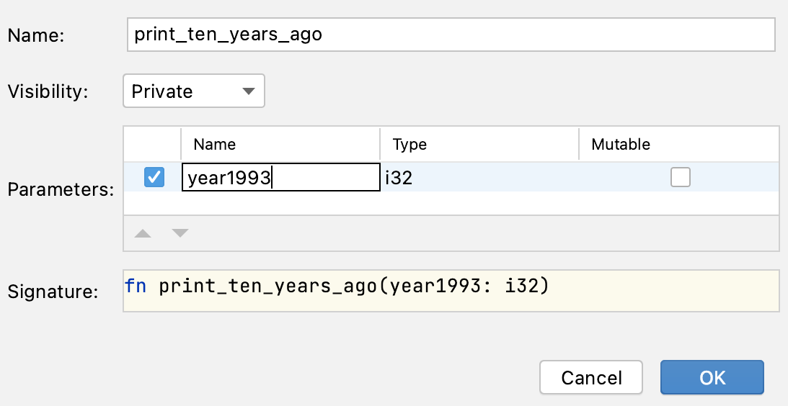

## Opanowanie IDE: Refaktoryzacja Metody Wyodrębniania

Pewien programista został poproszony o zmianę formatu komunikatu w kodzie, który widzisz w tym zadaniu.

Zamiast "1993: 10 years ago was 1983", chcemy wyświetlić "1993: ten years ago was 1983".

Jednak w obecnym podejściu programista musi zmieniać komunikat w dwóch miejscach, co stanie się jeszcze bardziej uciążliwe, gdy ten kod będzie używany w większej liczbie miejsc.

Dlatego przed faktyczną zmianą formatu komunikatu programista zdecydował się na refaktoryzację i stworzenie funkcji, która drukuje komunikat.

### Zadanie

**Krok 1: Stwórz funkcję**

Przeprowadź refaktoryzację i utwórz nową funkcję, aby zastąpić zduplikowany kod.

Wybierz pierwsze wystąpienie 

```rust
println!("{}: 10 years ago was {}", year1993, year1993 - 10);
```

następnie wciśnij &shortcut:ExtractMethod; lub wybierz *Refactor -> Extract Method...* z menu pod prawym przyciskiem myszy.

W oknie dialogowym, które się pojawi, możesz wybrać bardziej odpowiednią nazwę dla parametru (na przykład year):



**Krok 2: Zastąp zduplikowany kod**

Po utworzeniu nowej funkcji, zastąp drugie wystąpienie kodu wywołaniem nowej funkcji.

**Krok 3: Zmień tekst**

Na koniec, zmień "10" na "ten" w ciele funkcji.