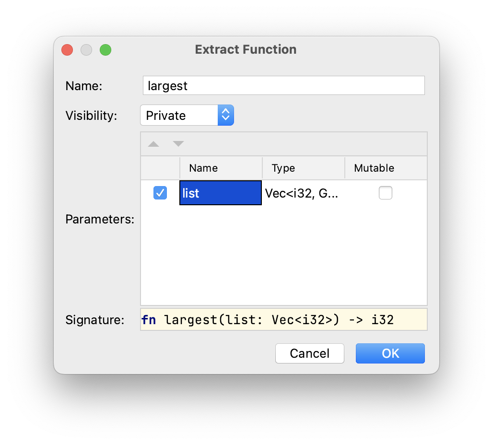

## Usuwanie duplikacji przez refaktoryzację

Aby wyeliminować tę duplikację, możemy stworzyć abstrakcję, definiując funkcję, która operuje na dowolnej liście liczb całkowitych przekazanej jako parametr. To rozwiązanie sprawia, że nasz kod staje się bardziej przejrzysty i pozwala nam abstrakcyjnie wyrazić koncepcję znajdowania największej liczby na liście.

Możemy to osiągnąć w kilku krokach, wykorzystując różne dostępne refaktoryzacje w %IDE_NAME%.

### Krok 1: Ekstrakcja funkcji

Zwróć uwagę na pierwszy blok w edytorze zaczynający się od linii 4. Zaznacz cały blok, a następnie naciśnij &shortcut:ExtractMethod; albo wybierz *Refactor -> Extract Method...* z menu kontekstowego po kliknięciu prawym przyciskiem myszy.

Wprowadź `largest` jako nazwę funkcji i zmień nazwę parametru na `list` w następujący sposób:



Po wykonaniu tej komendy cały fragment zostanie zastąpiony następującą jednolinijką:

```rust
let largest = largest(number_list);
```

Poniżej funkcji `main` zauważysz wyekstraktowaną funkcję:

```rust
fn largest(list: Vec<i32>) -> i32 {
    let mut largest = list[0];

    for number in list {
        if number > largest {
            largest = number;
        }
    }
    largest
}
```

Zauważ, że kod wciąż się kompiluje i działa jak wcześniej, zwracając te same wyniki.

### Krok 2: Zmiana nazwy zmiennej

Aby uniknąć konfliktów nazw, zmieńmy nazwy kilku zmiennych:

- pierwsze przypisanie zmiennej `largest` (linia 4) powinno zostać zmienione na `result`;
- drugie przypisanie zmiennej `largest` również powinno zostać zmienione na `result`.

Aby to zrobić, możesz nacisnąć &shortcut:RenameElement; albo wybrać *Refactor -> Rename...* po najechaniu na odpowiednią zmienną. Możesz także zapoznać się z [zadaniem wprowadzającym to refaktoryzowanie](course://Common Programming Concepts/Variables/Introduce Variable Refactoring), jeśli napotkasz trudności.

### Krok 3: Zastąpienie zduplikowanego fragmentu kodu

Możesz teraz zaznaczyć cały czwarty blok w edytorze i zastąpić go kolejnym wywołaniem funkcji `largest`, mianowicie `largest(number_list);`.

W tym momencie możesz również usunąć modyfikator `mut` dla drugiego przypisania `result`. Nie jest on już potrzebny.

### Krok 4: Dopasowanie typów

Możemy również chcieć, aby nasz parametr był bardziej ogólny. W tym celu zamieńmy `Vec<i32>` w definicji funkcji na referencję do wycinka `&[i32]`. Ta zmiana wprowadza kilka błędów kompilacji, które można naprawić, dodając `&` do zmiennych `number_list` w miejscach wywołania `fn largest` oraz do zmiennej `number` w nagłówku pętli `for` wewnątrz definicji funkcji.

Ta zmiana pozwoli nam używać tej samej funkcji dla wektorów, tablic i dowolnych wycinków `i32`.