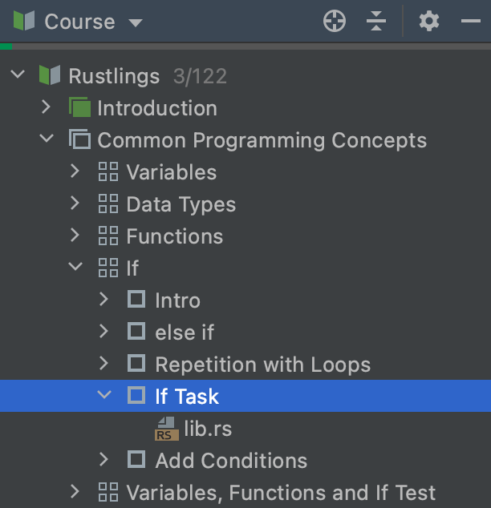

## Widok kursu

<b>Widok kursu</b> pokazuje program kursu: listę lekcji z zadaniami.

Możesz przejść do dowolnego zadania, klikając dwukrotnie jego nazwę.

Aby ukryć okno Widoku kursu, kliknij przycisk Okno narzędzi projektu lub naciśnij &shortcut:ActivateProjectToolWindow;. Dzięki temu zyskasz więcej miejsca na okna Edytora i Opisu zadania.

Aby przywrócić ukryte okno Widoku kursu, kliknij ponownie przycisk Okno narzędzi projektu (lub naciśnij &shortcut:ActivateProjectToolWindow;).