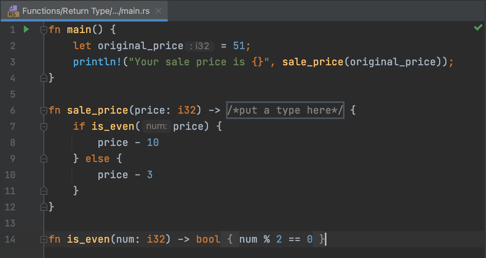
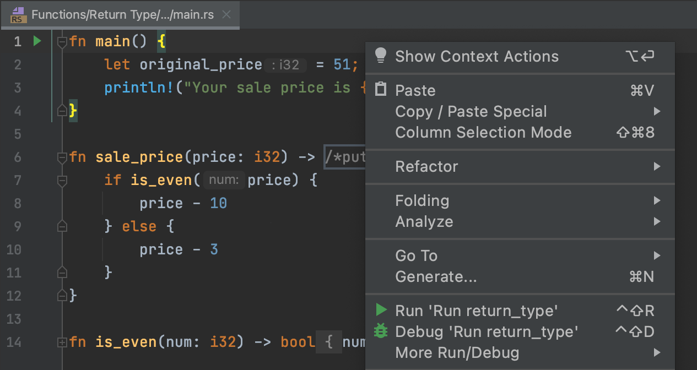

## Edytor

<b>Edytor</b> to Twoje miejsce pracy, w którym będziesz programować. Możesz tutaj eksperymentować podczas pracy nad zadaniami teoretycznymi i quizami, bez weryfikacji wyników.

W przypadku zadań programistycznych Edytor to miejsce, gdzie poprawisz istniejący kod lub napiszesz własny od podstaw. Ten kod będzie weryfikowany.

Aby uruchomić swój kod w dowolnym momencie, wybierz opcję Uruchom z menu kontekstowego lub naciśnij &shortcut:Run;:

Czasami może być pomocne uruchomienie funkcji `main()` (znajdującej się w pliku `main.rs`, jednak warto zauważyć, że nie we wszystkich zadaniach występuje), aby zobaczyć, jaki wynik generuje Twój kod. Jeśli chcesz wrócić do Edytora i skupić się na swoim kodzie, najszybszym sposobem jest użycie polecenia Ukryj wszystkie okna (&shortcut:HideAllWindows;). Aby przywrócić wszystkie okna, powtórz komendę.