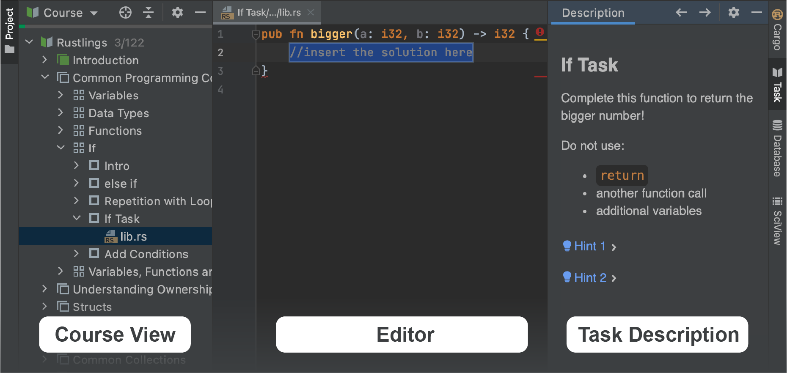

## Przegląd wtyczki JetBrains Academy

Ta lekcja pomoże Ci postawić pierwsze kroki z [wtyczką JetBrains Academy](https://www.jetbrains.com/help/education/educational-products.html) i używać jej do nauki języka Rust.

Dzięki wtyczce JetBrains Academy możesz uczyć się języków programowania i narzędzi, wykonując zadania kodowania oraz otrzymywać natychmiastową informację zwrotną bezpośrednio w IDE.

Dość gadania – zaczynajmy!

Jeśli znasz już interfejs, możesz pominąć tę lekcję.

### Praca z kursami
Każdy kurs dostępny w JetBrains Academy jest skonstruowany jako lista lekcji. Lekcje mogą być z kolei pogrupowane w sekcje. Każda lekcja zawiera kilka zadań.

Kiedy otworzysz kurs, zobaczysz główne okna narzędzi używane do nawigacji: <b>Widok kursu</b>, <b>Edytor</b> oraz <b>Opis zadania</b>:

Kliknij przycisk „Następny”, aby przejść do kolejnego zadania.